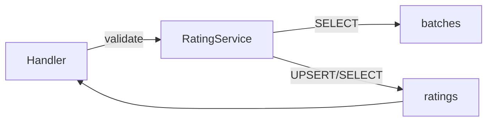

# API Endpoint Implementation Plan: Batch Rating (GET / PUT `/api/v1/batches/{batch_id}/rating`)

## 1. Przegląd punktu końcowego
Endpoint umożliwia właścicielowi zakończonego nastawu (status `archived`) dodanie lub aktualizację własnej oceny w skali 1-5 oraz odczyt istniejącej oceny.  
• **PUT** – dodaje lub aktualizuje ocenę (`ratings` upsert).  
• **GET** – zwraca ocenę użytkownika dla wskazanego nastawu.

## 2. Szczegóły żądania
| | PUT | GET |
|---|---|---|
|Metoda|`PUT`|`GET`|
|URL|`/api/v1/batches/{batch_id}/rating`|`/api/v1/batches/{batch_id}/rating`|
|Auth|`Authorization: Bearer {token}` (wymagane)|jw.|
|URL params|`batch_id: uuid` – identyfikator nastawu|jw.|
|Body|`{ "rating": 1-5 }`|–|
|Content-Type|`application/json`|–|

### Walidacja wejścia
1. `batch_id` – poprawny UUID (middleware param validator).  
2. `rating` – integer `1 <= rating <= 5` (Zod).  
3. Nastaw musi istnieć, należeć do użytkownika (RLS) i mieć `status = 'archived'` – w przeciwnym razie **403**.

## 3. Wykorzystywane typy
* **Command**: `UpsertRatingCommand` (`src/types.ts`)  
* **DTO**: `RatingDto` (`src/types.ts`)  
* **Error**: `ErrorResponseDto`

## 4. Szczegóły odpowiedzi
| Kod | Scenariusz | Struktura |
|-----|------------|-----------|
|200|GET – ocena istnieje | `RatingDto` |
|201|PUT – utworzono nową ocenę| `RatingDto` |
|200|PUT – zaktualizowano ocenę| `RatingDto` |
|400|Niepoprawne dane (`INVALID_RATING`) | `ErrorResponseDto` |
|401|Brak / niepoprawny token | jw. |
|403|Batch niearchiwalny (`BATCH_NOT_COMPLETED`) | jw. |
|404|Batch lub ocena nie istnieje | jw. |
|500|Błąd serwera / DB | jw. |

## 5. Przepływ danych
1. Klient wysyła żądanie z tokenem JWT.
2. Astro endpoint uzyskuje `supabase` z `context.locals` (middleware zapewnia uwierzytelnienie).
3. Walidacja parametrów URL (
   `id`), następnie `Zod` dla body (PUT).
4. Endpoint wywołuje **RatingService**:

5. Wynik (DTO) serializowany do JSON i zwracany.

## 6. Względy bezpieczeństwa
* **RLS** – tabele `batches`, `ratings` już chronione polityką właścicielską (`user_id = auth.uid()`).
* **Autoryzacja** – middleware sprawdza token; dodatkowo kod 403 jeśli batch niearchiwalny.
* **Walidacja** – `Zod` eliminuje niewłaściwe dane.
* **Injection** – SDK Supabase używa parametrów, brak SQL-injection.
* **Rate-limiting** – (rozważyć middleware globalny).

## 7. Obsługa błędów
| Warunek | Kod | `code` |
|---------|-----|--------|
|`rating` poza zakresem/nie int|400|`INVALID_RATING`|
|Batch `status != archived`|403|`BATCH_NOT_COMPLETED`|
|Batch nie istnieje|404|`BATCH_NOT_FOUND`|
|Ocena nie istnieje (GET)|404|`RATING_NOT_FOUND`|
|Błąd DB/nieoczekiwany|500|`INTERNAL_SERVER_ERROR`|

## 8. Rozważania dotyczące wydajności
* Operacje na pojedynczych wierszach, wykorzystują indeks (`ratings(batch_id)` oraz PK).  
* Użycie `UPSERT` minimalizuje liczbę zapytań (INSERT ... on conflict).
* Brak dużych payloadów.

## 9. Etapy wdrożenia
1. **Typy / Walidatory**  
   a. Dodaj `UpsertRatingSchema` do `src/lib/validators.ts`.  
2. **Service**  
   a. Utwórz `src/lib/rating.service.ts` z funkcjami `getRating`, `upsertRating`.  
   b. Weryfikuj `batch.status` == `archived`.  
   c. Użyj `supabase.from('ratings').upsert(...)` z `onConflict('batch_id, user_id')`.  
3. **Endpoint**  
   a. Utwórz plik `src/pages/api/v1/batches/[id]/rating.ts`.  
   b. Eksportuj `prerender = false`.  
   c. Implementuj `export async function GET(ctx)` i `export async function PUT(ctx)`.  
   d. Pobierz `supabase = ctx.locals.supabase`.  
   e. Walidacja `id` (uuid) i body (PUT).  
   f. Wywołaj odpowiednią metodę serwisu.  
   g. Zwróć DTO z kodem 200/201.  

